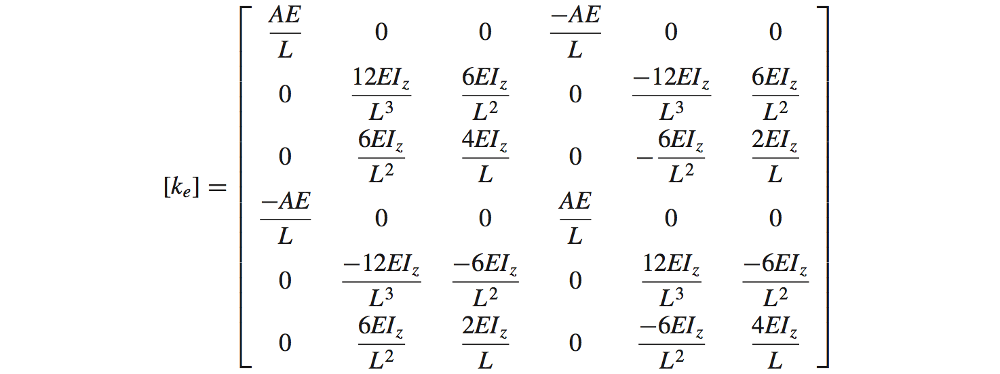
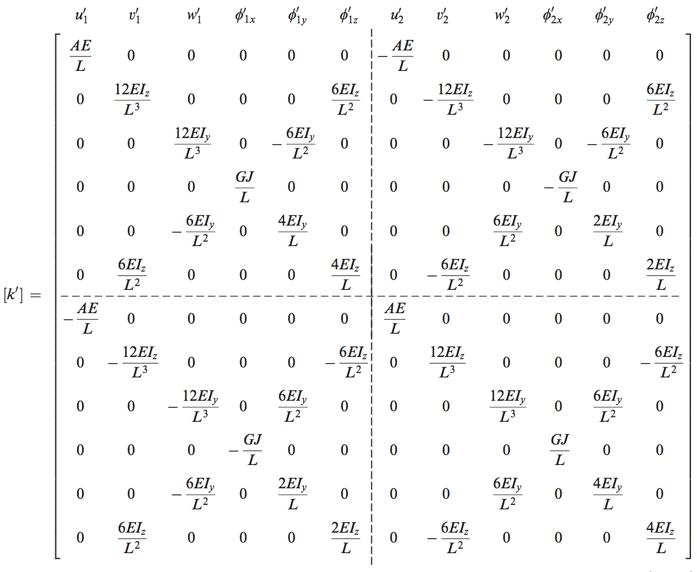

# Space-Frame
FEM of 2D/3D frame 

The algorithm is based on A first course in the Finite Element Method 5th ed, Logan.

This library uses Jama (https://math.nist.gov/javanumerics/jama/) as the linear solver, however, the user may use other Java solver instead by modifying the source file.

## 1. Input
double[][] nodes; // x,y,z-coordinates

int[][] members; //members[2] ={6,8} means the 3rd member links 7th node to 9th node.

double[][] loads; // nodal: fx, fy, fz, mx, my, mz

boolean[][] constrained; // e.g. constrained[2]={false, true, false, true, false, false}  //u, v, w, phix, phiy, phiz
	
Double[] memb_selfweis; //self-weight of beam, unit: N or lb.

double[] As; // cross-sectional area

double[] Es; // Young's modulus

double[] Gs; // shear modulus, or modulus of rigidity

double[] Js; // torsion constant

double[] Iy, Iz; // principal moment of inertia

## 2. Solver options
The algorithm solves a matrix equation Ku=F, where K is the stiffness matrix, u denotes the nodal displacements, and F is the nodal loads.

This library uses Jama to solve the equation: UA = M.solve_square_Axb(KAA, FA), see Frame3D.construct_matrices(). 

One might replace this method using other linear solvers for better performances: 1. https://ujmp.org, or 2.https://github.com/fommil/matrix-toolkits-java (very fast). 

## 3. Output

int lenA;  //the number of unconstrained nodal displacements.

String[] symbols; // the notations of unconstrained nodal displacements, symbols[4]=“2px” means that UA’s 5th element is the 3rd node's rotation around the x-axis.

double[] UA; // (unconstrained) nodal displacement / rotation

double[][] member_forces; // the local forces (fx1, fy1, fz1, mx1, my1, mz1, fx2, fy2, fz2, mx2, my2, mz2) of each member.

### formula

The stiffness matrix (2D frame):

The stiffness matrix (3D frame):

